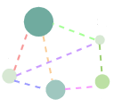
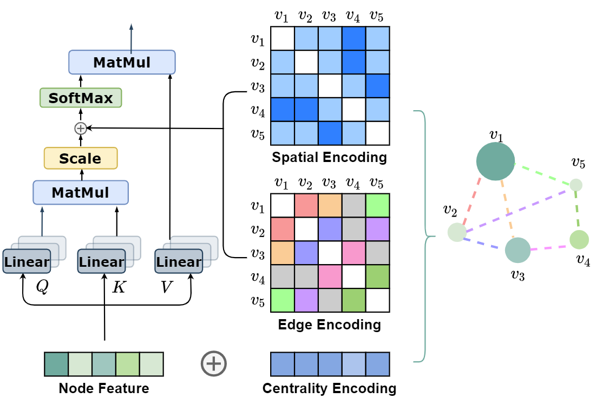

# Graphormer  


This repo is the official implementation of ["Do Transformers Really Perform Badly for Graph Representation?"](https://openreview.net/forum?id=OeWooOxFwDa). 

## News

***12/10/2021***
  1. **Graphormer** has won the [Open Catalyst Challenge](https://opencatalystproject.org/challenge.html). The technical talk could be found through this [link](https://www.youtube.com/watch?v=uKJX3Mpu3OA&ab_channel=OpenCatalystProject).
  2. The **slides** of NeurIPS 2021 could be found through this [link](https://neurips.cc/media/neurips-2021/Slides/27679_XmkCZkZ.pdf).
  3. The **new release** of Graphormer is comming soon, as a general molecule modeling toolkit, with models used in OC dataset, completed pre-trained model zoo, flexible data interface, and higher effiency of training.

***09/30/2021***
  1. **Graphormer** has been accepted by **NeurIPS 2021**.
  2. We're hiring! Please contact ``shuz[at]microsoft.com`` for more information.


***08/03/2021***
  1. Codes and scripts are released.
  
***06/16/2021***
  1. Graphormer has won the **1st place** of quantum prediction track of Open Graph Benchmark Large-Scale Challenge (KDD CUP 2021) [[Competition Description]](https://ogb.stanford.edu/kddcup2021/pcqm4m/) [[Competition Result]](https://ogb.stanford.edu/kddcup2021/results/) [[Technical Report]](https://arxiv.org/pdf/2106.08279.pdf)   [[Blog (English)]](https://www.microsoft.com/en-us/research/lab/microsoft-research-asia/articles/transformer-stands-out-as-the-best-graph-learner-researchers-from-microsoft-research-asia-wins-the-kdd-cups-2021-graph-prediction-track/) [[Blog (Chinese)]](https://www.msra.cn/zh-cn/news/features/ogb-lsc) 


## Introduction
**Graphormer** is initially described in [arxiv](https://arxiv.org/abs/2106.05234), which is a standard Transformer architecture with several structural encodings, which could effectively encoding the structural information of a graph into the model. 

Graphormer achieves strong performance on PCQM4M-LSC (`0.1234 MAE` on val), MolPCBA (`31.39 AP(%)` on test), MolHIV (`80.51 AUC(%)` on test) and ZINC (`0.122 MAE on test`), surpassing previous models by a large margin.


<p align="center">
   
</p>

## Main Results 

#### PCQM4M-LSC
Method        | #params | train MAE | valid MAE |
--------------|---------|-----------|-----------|
GCN          | 2.0M    | 0.1318    | 0.1691    |
GIN          | 3.8M    | 0.1203    | 0.1537    |
GCN-VN          | 4.9M    | 0.1225    | 0.1485    |
GIN-VN          | 6.7M    | 0.1150    | 0.1395    |
Graphormer-Small| 12.5M   | 0.0778    | 0.1264    |
Graphormer   | 47.1M   | 0.0582    | **0.1234**    |

#### OGBG-MolPCBA
Method        | #params | test AP (%)|
--------------|---------|------------|
DeeperGCN-VN+FLAG         | 5.6M    | 28.42      |
DGN          | 6.7M    | 28.85      |
GINE-VN          | 6.1M    | 29.17      |
PHC-GNN          | 1.7M    | 29.47      |
GINE-APPNP          | 6.1M    | 29.79      |
Graphormer   | 119.5M  | **31.39**      |

#### OGBG-MolHIV
Method        | #params | test AP (%)|
--------------|---------|------------|
GCN-GraphNorm          | 526K    | 78.83      |
PNA          | 326K    | 79.05      |
PHC-GNN          | 111K    | 79.34      |
DeeperGCN-FLAG          | 532K    | 79.42      |
DGN          | 114K    | 79.70      |
Graphormer   | 47.0M   | **80.51**      |

#### ZINC-500K
Method        | #params | test MAE   |
--------------|---------|------------|
GIN          | 509.5K  | 0.526     |
GraphSage          | 505.3K  | 0.398      |
GAT          | 531.3K  | 0.384      |
GCN          | 505.1K  | 0.367      |
GT          | 588.9K  | 0.226      |
GatedGCN-PE          | 505.0K  | 0.214      |
MPNN (sum)          | 480.8K  | 0.145      |
PNA          | 387.2K  | 0.142      |
SAN          | 508.6K  | 0.139      |
Graphormer-Slim   | 489.3K  | **0.122**      |


## Requirements and Installation

#### Setup with Conda
```
# create a new environment
conda create --name graphormer python=3.7
conda activate graphormer
# install requirements
pip install rdkit-pypi cython
pip install ogb==1.3.1 pytorch-lightning==1.3.0
pip install torch==1.7.1+cu110 torchvision==0.8.2+cu110 -f https://download.pytorch.org/whl/torch_stable.html
pip install torch-geometric==1.6.3 ogb==1.3.1 pytorch-lightning==1.3.1 tqdm torch-sparse==0.6.9 torch-scatter==2.0.6 -f https://pytorch-geometric.com/whl/torch-1.7.0+cu110.html
```

## Citation
Please kindly cite this paper if you use the code:
```
@inproceedings{
ying2021do,
title={Do Transformers Really Perform Badly for Graph Representation?},
author={Chengxuan Ying and Tianle Cai and Shengjie Luo and Shuxin Zheng and Guolin Ke and Di He and Yanming Shen and Tie-Yan Liu},
booktitle={Thirty-Fifth Conference on Neural Information Processing Systems},
year={2021},
url={https://openreview.net/forum?id=OeWooOxFwDa}
}
```

## Contributing

This project welcomes contributions and suggestions.  Most contributions require you to agree to a
Contributor License Agreement (CLA) declaring that you have the right to, and actually do, grant us
the rights to use your contribution. For details, visit https://cla.opensource.microsoft.com.

When you submit a pull request, a CLA bot will automatically determine whether you need to provide
a CLA and decorate the PR appropriately (e.g., status check, comment). Simply follow the instructions
provided by the bot. You will only need to do this once across all repos using our CLA.

This project has adopted the [Microsoft Open Source Code of Conduct](https://opensource.microsoft.com/codeofconduct/).
For more information see the [Code of Conduct FAQ](https://opensource.microsoft.com/codeofconduct/faq/) or
contact [opencode@microsoft.com](mailto:opencode@microsoft.com) with any additional questions or comments.

## Trademarks

This project may contain trademarks or logos for projects, products, or services. Authorized use of Microsoft 
trademarks or logos is subject to and must follow 
[Microsoft's Trademark & Brand Guidelines](https://www.microsoft.com/en-us/legal/intellectualproperty/trademarks/usage/general).
Use of Microsoft trademarks or logos in modified versions of this project must not cause confusion or imply Microsoft sponsorship.
Any use of third-party trademarks or logos are subject to those third-party's policies.
